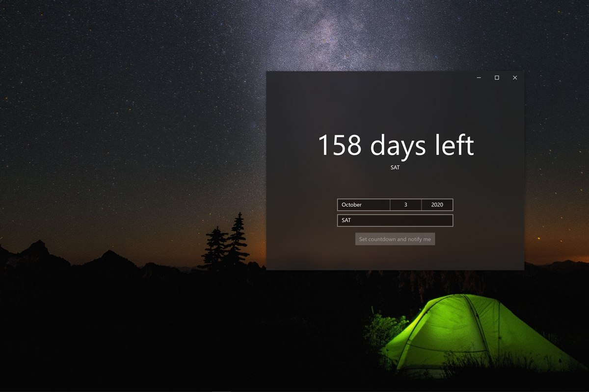
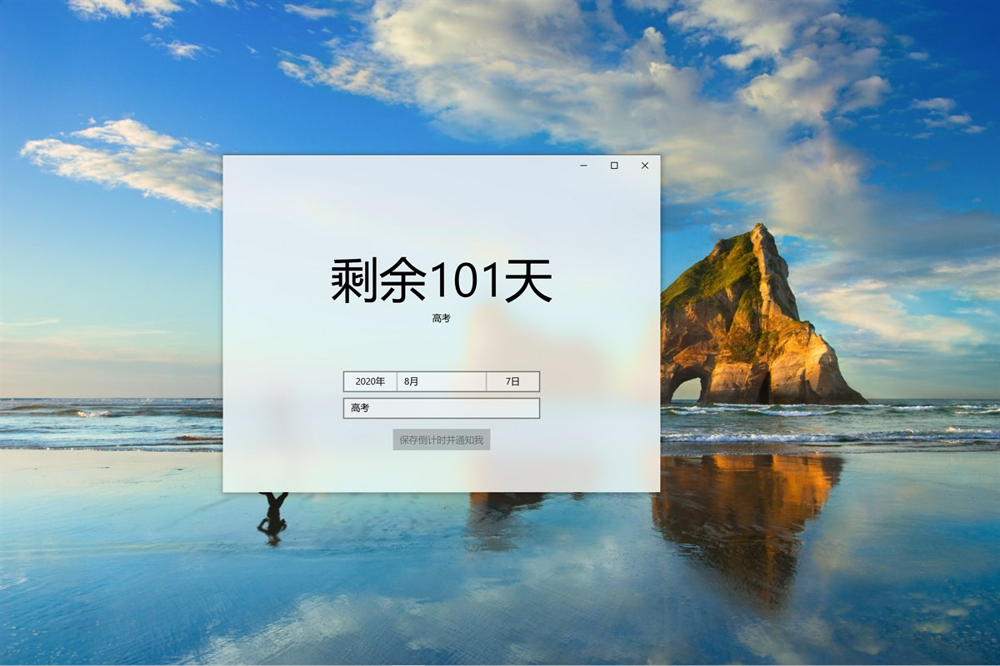

# Date Countdown

Date Countdown is a small Windows countdown app built with WinUI 3. It helps you keep track of important dates with a compact desktop interface, optional startup notifications, Windows 10 Start tile updates, and Windows 11 Widgets integration.

  

## Features

- **Multiple Countdowns**: Create and switch between multiple saved countdowns.
- **Compact Interface**: A focused date and title editor designed to stay small and unobtrusive.
- **Startup Notifications**:
  - Enable notifications per countdown.
  - Receive reminders when Windows starts.
- **Windows Integration**:
  - Windows 10: update a pinned Start tile.
  - Windows 11: provide a Date Countdown widget for the Widgets board.
- **Custom Text Size**: Adjust the main countdown text and event title text separately with a live preview.
- **Sorting**: Sort countdowns by days remaining.
- **Localization**: Includes English and Simplified Chinese resources.

## Requirements

- Windows 10 version 1809 (Build 17763) or later.
- Windows 11 is required for Widgets integration.
- No separate .NET runtime installation is required for the Microsoft Store/MSIX package.

### Building

1. Open the solution in Visual Studio 2022.
2. Ensure the .NET 8 SDK and Windows App SDK workload are installed.
3. Build and run the `DateCountdown` project.

## Screenshots

## License

Date Countdown is released under the [MIT License](LICENSE).

## Acknowledgments

This project was developed with the assistance of AI tools, including GitHub Copilot and Codex, to accelerate development and refine the user interface.
